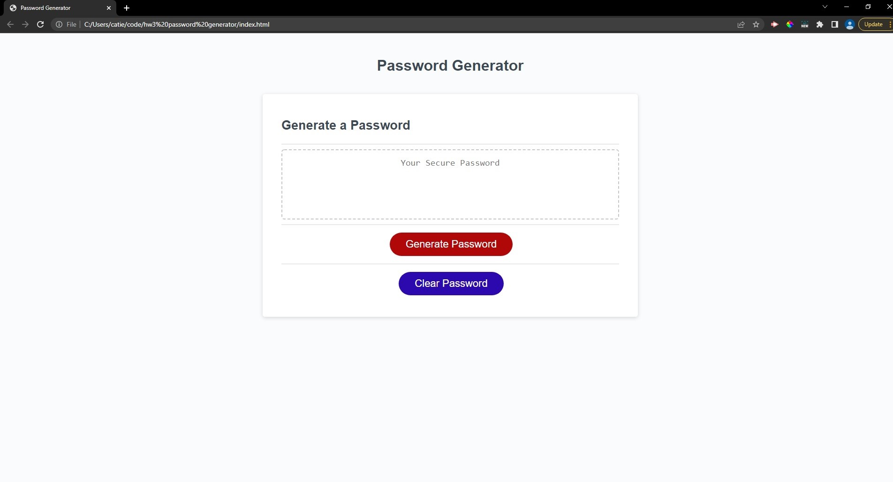

# Password Generator

This is a project for coding bootcamp. It has been designed to generate a random password based on the chosen prompted criteria. When the red button is clicked, the user will be prompted to pick different types of characters to use, as well as a password length. Once all the prompts are answered, a randomize password will be displayed on the page.

## Screenshot

## Links to Application

- Here is the [link to page](https://coconnor10.github.io/HW3/)
- Here is the [link to github](https://github.com/coconnor10/HW3)
